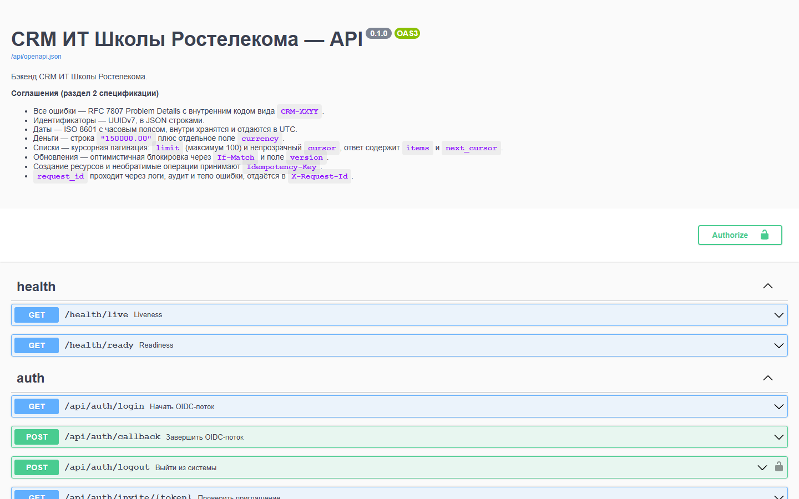
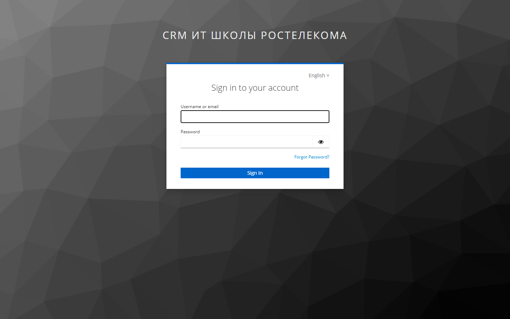
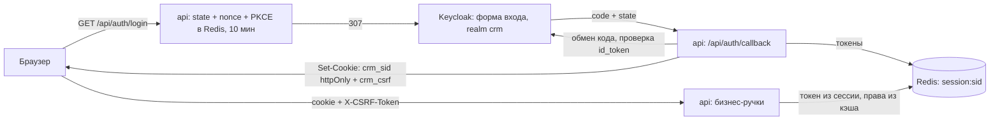
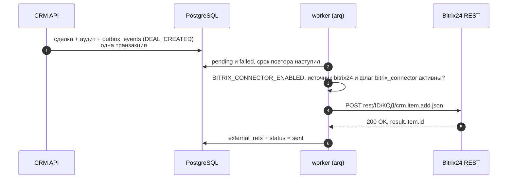
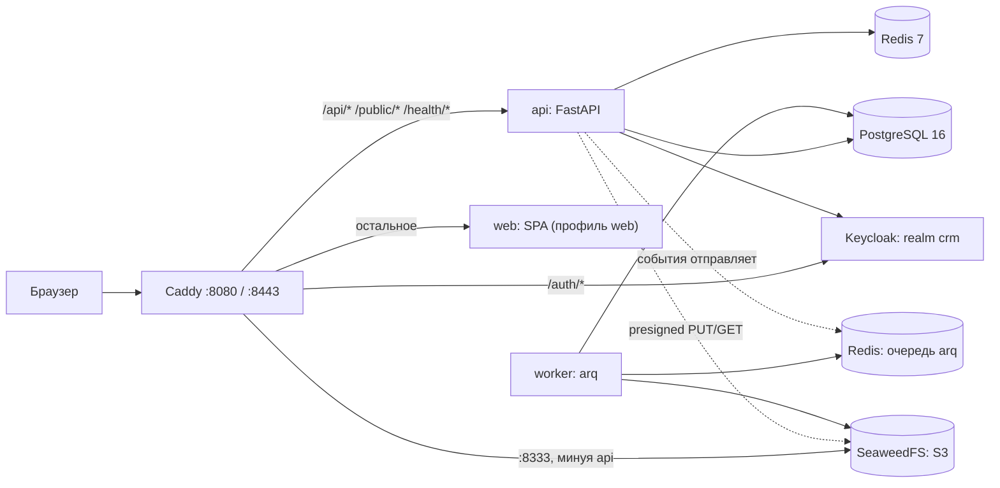

<div align="center">

# RTK School CRM — бэкенд

**Модульный монолит на FastAPI для CRM ИТ Школы Ростелекома: закрытый контур, вход через Keycloak, неизменяемый аудит и простая электронная подпись**

<sub>Команда **«Тесткит»** — [github.com/lct-testkit](https://github.com/lct-testkit)</sub>

<!--STATS-->
**210** операций API &nbsp;·&nbsp; **13** модулей &nbsp;·&nbsp; **67** таблиц &nbsp;·&nbsp; **24** миграции &nbsp;·&nbsp; **2152** теста &nbsp;·&nbsp; **11** сервисов Compose
<!--/STATS-->

[Быстрый старт](#быстрый-старт) · [Примеры](#примеры-использования) · [Приём данных](#приём-данных-вендоры-оплаты-учащиеся) · [Как устроено](#как-устроено) · [Модули](#что-внутри) · [Настройка](#настройка) · [Разработка](#разработка) · [Безопасность](#безопасность) · [Ограничения](#ограничения-и-известные-проблемы)

|  |  |
|:-:|:-:|
| *Swagger UI — `/api/docs`, OpenAPI 3.0.3* | *вход Keycloak — `/auth`, realm `crm`* |

<sub>Обе страницы отдаёт один Caddy на порту 8080. Swagger UI подключён из локального пакета, без CDN: контур закрыт и в рантайме не ходит в интернет.</sub>

</div>

## Почему это интересно

* **Закрытый контур, запуск одной командой.** `docker compose up -d --build` поднимает 11 сервисов; интернет нужен только на сборке образов. Swagger UI отдаётся из локального пакета, шрифт с кириллицей для PDF вложен в образ — CDN не нужны.
* **BFF: токены Keycloak не покидают Redis.** Браузер получает только httpOnly-cookie сессии (`Secure` — по фактической схеме `BASE_URL`, `SameSite=Lax`) и CSRF-cookie. Вход — OIDC с `state`, `nonce` и PKCE S256, `id_token` проверяется полностью, обновление токена идёт под локом.
* **Идемпотентность и оптимистичные блокировки.** `Idempotency-Key` (8–255 символов, ключ живёт внутри актора) на создании сделок, организаций и контактов и на вебхуке сайта (`POST /api/v1/integrations/cms/leads`): тот же ключ с другим телом — `409 CRM-1003`. Изменения требуют `If-Match` с `version`, конфликт — `409 CRM-1002` с актуальными значениями.
* **RFC 7807 везде.** Любая ошибка — `application/problem+json` с кодом из каталога `CRM-XXYY` (50 кодов) и `request_id`; стектрейсы наружу не уходят.
* **Неизменяемый аудит с цепочкой хэшей.** `audit_log` партиционирован по месяцам, триггеры на каждой партиции запрещают `UPDATE`, `DELETE` и `TRUNCATE`, каждая запись хранит `prev_hash` и SHA-256 `hash`; `GET /api/admin/audit/verify-chain` пересчитывает хвост цепочки. Запись идёт в той же транзакции, что и бизнес-изменение; отказы в доступе тоже попадают в журнал.
* **ПЭП с проверкой.** Одноразовый код (6 цифр, в базе только bcrypt-хэш, 3 попытки, 5 минут), HMAC-SHA256 метка целостности, цепочка хэшей подписей, неизменяемая таблица `signatures`, доверенное время из контейнера `ntp` (рассинхрон больше 5 с блокирует подписание), публичная проверка `/public/verify/{id}` и проверка файла по хэшу.
* **152-ФЗ и обезличивание.** Согласие на обработку ПДн хранится с версией политики и SHA-256 её текста (до принятия бизнес-ручки отвечают `403 CRM-1105`); маскирование телефонов и email; запросы на удаление или обезличивание с блокерами, отсрочкой 30 дней, подтверждением второго администратора и актом об уничтожении.
* **Воронки — граф с публикацией и мастером сопоставления.** Статусы и переходы с DSL условий (белый список полей), валидация графа, публикация со снимком и `graph_hash`: сделки живут по опубликованному снимку. Архивирование статуса — мастер сопоставления, который переносит сделки батчами в фоне.
* **RBAC, иерархия команд и «четыре глаза».** Пять ролей, 40 прав и три уровня проверки: маршрут, объект, SQL-скоуп списка (свои сделки, команда рекурсивно по дереву `teams`, все, только созданные источником). Необратимые админ-операции подтверждает второй администратор (`CRM-1902`).

## Как это выглядит

> Картинки этого файла — `docs/img/swagger.png` и `docs/img/keycloak-login.png`: оба экрана открываются на http://localhost:8080 после запуска стека.


*Swagger UI на `/api/docs`: 203 операции в 30 группах, схемы безопасности `BearerAuth` (вставьте access-токен Keycloak в Authorize), `SessionCookie` и `CsrfToken`. В `prod` интерактивный UI закрыт, схема `/api/openapi.json` остаётся.*


*Вход: `GET /api/auth/login` отправляет браузер в Keycloak, после ввода пароля бэкенд создаёт серверную сессию.*



## Быстрый старт

Нужны Docker с Compose v2. Интернет требуется только на сборке образов, в рантайме контур закрыт.

```bash
cp .env.example .env
```

```bash
docker compose up -d --build
```

Поднимутся 11 сервисов: `postgres`, `redis`, `seaweedfs`, `keycloak`, `ntp`, `sms-gateway-mock`, разовые `migrate` (миграции) и `seed` (две демо-воронки: `b2b_university_v1` на 14 шагов, `b2c_individual_v1` на 6), затем `api`, `worker` и `caddy`. `migrate` и `seed` после завершения видны только в `docker compose ps -a` (`Exited (0)`); `api` и `worker` стартуют после успешного `seed`, `api` дополнительно ждёт готовности Keycloak. На чистой машине это около минуты, дольше всего поднимается Keycloak.

```bash
curl http://localhost:8080/health/ready
```

Ожидается `"status":"ok"` и `"ok":true` у `postgres`, `redis`, `keycloak_jwks`, `seaweedfs` и `queue`. Веб-клиент подключается профилем `web` (см. ниже); без него на `/` Caddy отвечает ошибкой, API и Keycloak работают.

| Адрес | Что это |
|---|---|
| http://localhost:8080/api/docs | Swagger UI (в профиле `prod` закрыт) |
| http://localhost:8080/api/openapi.json | OpenAPI 3.0.3, 203 операции |
| http://localhost:8080/health/live | liveness |
| http://localhost:8080/health/ready | готовность: БД, Redis, JWKS Keycloak, SeaweedFS, очередь |
| http://localhost:8080/auth | Keycloak, realm `crm`; консоль — `/auth/admin` |
| http://localhost:8080/ | веб-клиент (профиль `web` или Vite через `WEB_UPSTREAM`) |
| http://localhost:8333 | SeaweedFS S3 через Caddy: presigned-ссылки, браузер ходит сюда напрямую, минуя API |
| localhost:5433 | PostgreSQL для pgAdmin (`POSTGRES_PORT`): база `crm`, пользователь `crm` |
| https://localhost:8443 | то же по TLS (`tls internal`, самоподписанный сертификат — предупреждение браузера ожидаемо) |

Метрики Prometheus доступны только внутри сети (`api:8000/metrics`, воркер — `worker:9101/metrics`): через Caddy `/metrics` отвечает `404`.

Демо-учётки создаются при импорте realm `crm` (`deploy/keycloak/realm-crm.json`). **Только для демо**, в настоящей эксплуатации заменить:

| Логин | Пароль | Роль |
|---|---|---|
| `kam.ivanov` | `Kam123456789!` | KAM: свои сделки, организации, подписи |
| `head.petrov` | `Head12345678!` | HEAD: сделки команды, импорт, переназначение |
| `admin.crm` | `Admin12345678!` | ADMIN: все права |
| `admin.volkov` | `Volkov12345678!` | ADMIN (второй, для «четырёх глаз») |
| `auditor.smirnov` | `Audit12345678!` | AUDITOR: журнал аудита |
| `admin` (консоль Keycloak) | `admin` | `/auth/admin` (`KEYCLOAK_ADMIN`, `KEYCLOAK_ADMIN_PASSWORD`) |

Три вещи, о которые спотыкаются:

* **Профиль.** В `.env.example` стоит `APP_PROFILE=dev`, а дефолт в compose — `demo`. `dev`: cookie без `Secure`; `dev` и `demo`: Swagger UI, вход по Bearer для всех ролей, CORS для `localhost:5173` и `localhost:3000`, заглушка автоподстановки ИНН, код ПЭП в поле `debug_code`. `prod`: Swagger UI закрыт (схема остаётся), Bearer только у роли `INTEGRATION`, всё перечисленное выше выключено.
* **Переменные.** В контейнеры `api`, `worker`, `migrate` и `seed` попадают только переменные из списка `x-api-env` в `docker-compose.yml` (`env_file` не используется): значения из `.env` для остальных настроек (лимиты, таймауты) не действуют, пока их не добавят в этот список. Подробнее — «Настройка».
* **Код не монтируется.** Образы `api`, `worker`, `migrate`, `seed` и `sms-gateway-mock` собираются из `Dockerfile` (`COPY app`, `COPY migrations`), bind-mount нет. Правка кода требует пересборки: `docker compose up -d --build api worker`.

Веб-клиент собирается из соседнего репозитория `../frontend` (нужен пакет дизайн-системы, см. [`README продукта`](https://github.com/lct-testkit/.github#readme)):

```bash
docker compose --profile web up -d --build
```

`api` горизонтально масштабируется репликами: у сервиса нет `container_name` и портов на хосте, Caddy находит реплики через DNS (`dynamic a`, обновление раз в 10 секунд) и балансирует по `least_conn`. Один uvicorn-воркер на контейнер: реестр `prometheus_client` живёт в памяти процесса, и при нескольких воркерах scrape видел бы лишь часть трафика.

```bash
docker compose up -d --scale api=3
```

## Примеры использования

Все команды и ответы ниже проверены на живом стенде (тот же `docker compose up -d --build`, демо-учётки из «Быстрого старта»). Ответы урезаны — длинные значения и повторяющиеся поля отмечены `…`.

### Вход и профиль (password grant)

Password grant — прямой обмен пароля на токен Keycloak, минуя браузерный OIDC-поток; удобен для проверки контура и для сервисных вызовов. `client_secret` — из вашего `.env` (`KEYCLOAK_CLIENT_SECRET`, по умолчанию `crm-bff-secret`).

<details>
<summary>Код и ответ (18 строк)</summary>

```bash
SECRET=$(grep '^KEYCLOAK_CLIENT_SECRET=' .env | cut -d= -f2-)

TOKEN=$(curl -s http://localhost:8080/auth/realms/crm/protocol/openid-connect/token \
  -d grant_type=password -d client_id=crm-bff -d client_secret="$SECRET" \
  -d scope=openid -d username=kam.ivanov --data-urlencode 'password=Kam123456789!' \
  | sed -n 's/.*"access_token":"\([^"]*\)".*/\1/p')

curl -s http://localhost:8080/api/me -H "Authorization: Bearer $TOKEN"
```

```json
{"id":"01a0bf55-486b-7000-9454-4c74200b2209","full_name":"Иван Тесткитович","email":"ivanov@rt-it-school.ru",
 "role":"KAM","team_id":"01a0c00e-…","status":"active","locale":"ru","timezone":"Europe/Moscow",
 "consent_required":false,"password_change_required":false,
 "scopes":["catalog:read","contact:read","contact:reveal","contact:write","deal:create","deal:read", …],
 "teams":["01a0c00e-…"],"perm_epoch":1,"last_login_at":"2026-09-20T18:23:56.579722Z","version":2}
```

</details>

Без токена бизнес-ручки отвечают RFC 7807:

```bash
curl -s http://localhost:8080/api/deals
```

```json
{"type":"https://crm.rt-it-school.ru/problems/crm-1101","title":"Пользователь не аутентифицирован",
 "status":401,"detail":"Сессия не найдена: выполните вход","instance":"/api/deals",
 "request_id":"cfe79a19-…","code":"CRM-1101"}
```

### Список сделок: курсорная пагинация

```bash
curl -s "http://localhost:8080/api/deals?limit=3" -H "Authorization: Bearer $TOKEN"
```

Ответ — `{"items": [...], "next_cursor": "eyJ2Ijoi…"}`; три сделки на странице, каждая с `number`, `title`, `amount` строкой (`"150000.00"`) и отдельным `currency`, `version` для `If-Match`. Тот же `next_cursor`, переданный в `&cursor=`, возвращает следующие три без пересечений — проверено (id страниц 1 и 2 не совпали). `limit` больше 100 отклоняется `422 CRM-1001`.

### Проверка цепочки аудита

```bash
curl -s "http://localhost:8080/api/admin/audit/verify-chain?limit=1000" -H "Authorization: Bearer $ADMIN_TOKEN"
```

```json
{"checked":1000,"ok":true,"problems":[]}
```

Проверка идёт по хэшам подряд идущих записей; при разрыве `ok` равен `false`, а `problems` перечисляет записи. Раньше при параллельных записях цепочка рвалась (время брали как начало транзакции, а не момент захвата замка); теперь порядок хэшей и времени совпадает, а тест `test_audit_chain_concurrency.py` держит это под нагрузкой.

### Скачать контракт OpenAPI

```bash
curl -s http://localhost:8080/api/openapi.json -o openapi.json
```

`openapi.json` — 3.0.3, 165 путей, 210 операций, 243 схемы, схемы безопасности `BearerAuth`, `SessionCookie` (cookie `crm_sid`) и `CsrfToken` (заголовок `X-CSRF-Token`), ошибки — общая схема `Problem` (RFC 7807, `application/problem+json`). Тот же файл — источник для генератора клиента фронтенда (`frontend/tools/gen-api.mjs`).

### Автоподстановка и проверка ИНН

```bash
curl -s -X POST http://localhost:8080/api/org-lookup/validate \
  -H "Authorization: Bearer $TOKEN" -H 'Content-Type: application/json' \
  -d '{"kind":"inn","value":"7707083893"}'
```

```json
{"ok":true,"reason":null}
```

```bash
curl -s "http://localhost:8080/api/org-lookup/suggest?q=7707&limit=2" -H "Authorization: Bearer $TOKEN"
```

```json
{"items":[{"inn":"7707049388","name":"ПАО «Ростелеком»","region":null,"status":"active","is_liquidated":false,"provider":"mock"}]}
```

`provider":"mock"` — цепочка «локальный реестр ЕГРЮЛ → подтверждённые организации нашей БД → мок-провайдер»; мок подключается только вне `prod`. Внешний источник — публичный поиск ФНС (`egrul.nalog.ru`, провайдер `fns_egrul`, поиск по ИНН и названию) — стоит в цепочке перед моком и работает только при включённом флаге функции `external_org_lookup` (админка, «Настройки → Флаги»; по умолчанию выключен, адрес и таймаут — `FNS_LOOKUP_BASE_URL`, `FNS_LOOKUP_TIMEOUT_SECONDS`). Сервис недоступен или отказал — цепочка идёт дальше, после трёх неудач подряд источник на минуту отключается; адреса и ОКВЭД в выдаче ФНС нет, их даёт локальный реестр.

### Redirect-safe вход (проверка исправления открытого редиректа)

```bash
curl -si "http://localhost:8080/api/auth/login?next=/deals" | grep -i location
curl -si "http://localhost:8080/api/auth/login?next=https://evil.example" | grep -i location
```

Оба ответа — `307` на Keycloak с одинаковой формой `redirect_uri=…/api/auth/callback`; посторонний адрес в `next` не влияет на редирект — он либо сохраняется в Redis как безопасный путь (`/deals`), либо отбрасывается в `null` (`app/modules/identity/redirects.py::safe_next_path`, проверено `tests/test_redirects.py`).

### Доставка сделки в Битрикс24 (проверено на живом портале)

Создание сделки пишет событие `DEAL_CREATED` в `outbox_events` **в той же транзакции**, что сделку и запись аудита; воркер раз в минуту (`integration.tasks.sweep_outbox_events`) доставляет его в Битрикс24 методом `crm.item.add` через входящий вебхук (`integration/bitrix.py`), а id, который вернул Битрикс, сохраняет в `external_refs`. Полный разбор с логами, БД и скриншотами из самого Битрикса — в [README фронтенда](https://github.com/lct-testkit/frontend#интеграция-с-битрикс24).



Включается четырьмя условиями, все обязательны: `BITRIX_CONNECTOR_ENABLED=true`, `BITRIX_WEBHOOK_URL=https://<портал>/rest/<id>/<код>` (весь URL — секрет, в БД хранится только имя переменной), переключатель источника `bitrix24` в «Настройка → Интеграции» и флаг функции `bitrix_connector` в «Настройки»: выключенный флаг переводит события в `dead` (`last_error=feature_flag_disabled`), а отсутствие строки флага доставку не блокирует. Поле `sourceId` сделки берётся из `BITRIX_SOURCE_ID` (по умолчанию `OTHER`).

```bash
docker compose exec -T postgres psql -U crm -d crm -x -c "SELECT event_type, target, status, attempts, last_error, created_at, sent_at FROM outbox_events WHERE target='bitrix24' ORDER BY created_at DESC LIMIT 1;"
docker compose exec -T postgres psql -U crm -d crm -x -c "SELECT entity_type, external_id, synced_version, sync_direction, last_synced_at FROM external_refs WHERE source_code='bitrix24';"
```

Первая команда показывает статус доставки последнего события (`sent`, число попыток, ошибка), вторая — связь «сделка ↔ id в Битриксе». Повторы: 1 с, 5 с, 30 с, 5 мин, 30 мин, 2 ч, после 8-й неудачи — `dead` (разбор вручную: `GET /api/admin/integrations/outbox-events?status=dead` или вкладка «Исходящие»; вернуть событие в очередь — `POST /api/admin/integrations/outbox-events/{id}/retry`). При обновлении перед `crm.item.update` читается `crm.item.get`: если в Битриксе сделку правили после нашей последней синхронизации (`updatedTime`), запись не затирается, доставка падает с «требует ручного разбора». Обратного направления реальными событиями Битрикса нет — `POST /api/v1/integrations/bitrix/webhook` принимает упрощённый собственный контракт с HMAC-подписью. URL вебхука в логи не попадает: логгеры `httpx`/`httpcore` подняты до WARNING (`app/core/logging.py`, `tests/test_logging.py`).

## Приём данных: вендоры, оплаты, учащиеся

Три файла заказчика попадают в систему одним мастером импорта (`/api/imports`): загрузка файла → профиль колонок → сопоставление → dry-run → применение → откат. Тип задания (`entity_type`) выбирает набор полей, синонимы заголовков и правила проверки; список типов с полями и подсказками — `GET /api/imports/entity-types`.

| Файл | `entity_type` | Формат | Что создаётся |
|---|---|---|---|
| «Вендоры» | `vendor_contact` | xlsx / xls / csv / json | организация-вендор → продукты (несколько в одной ячейке) → контакт-ответственный → связи «контакт — продукт» |
| «Данные оплат» | `payment` | json (массив объектов, `null`-элементы пропускаются) / xlsx / csv | контакт (B2C) → продукт → сделка в статусе «Оплата и договор оферты» с номером заявки и потоком |
| «Загрузка пользователей» (шаблон LMS) | `learner` | xlsx / xls / csv | контакт + профиль учащегося (СНИЛС, паспорт, адрес регистрации, диплом) |

Что гарантирует импорт:

* **Один человек — одна карточка.** Совпал email (без учёта регистра) — тот же контакт; совпал телефон (любая запись: `+7 (999) …`, `8 999 …`, число из ячейки Excel приводятся к E.164) и фамилия — тот же; только телефон при другой фамилии — не дубль (общий номер кафедры). У найденного контакта заполняются лишь пустые поля, значения не перезаписываются.
* **Повторная загрузка не плодит записи.** Сделка по оплате ищется по `Номер заявки` (уникален на уровне БД), поэтому тот же заказ из файла и из вебхука сайта — одна сделка; вендоры и продукты ищутся по названию без учёта кавычек, регистра и «ё».
* **Строка — атомарна.** Каждая строка выполняется в своём SAVEPOINT: ошибка в одной не отменяет остальные, причина видна в `GET /api/imports/{id}/rows` (значения ПДн маскированы).
* **Откат по эффектам.** Строка, создавшая несколько записей (вендор + продукт + контакт + связь), откатывается целиком и в обратном порядке; записи, на которые уже опирается живая сделка, откат не удаляет и помечает как заблокированные (`completed_with_errors`).
* **ПДн учащегося не попадают в журнал и логи.** В аудит уходят имена изменённых полей; профиль отдаётся маскированным, полные значения — только `POST /api/contacts/{id}/learner-profile/reveal` с записью `PII_REVEALED`.

Выгрузка обратно в LMS — отчёт `lms_users_upload` (роли HEAD и ADMIN): xlsx в точности по шаблону заказчика, 30 колонок, справочники «Пол» и «Образование» на втором листе.

## Как устроено



| Слой | Что делает |
|---|---|
| **Caddy** | единая точка входа, TLS-терминация (`:8443`), CSP/HSTS/`X-Request-Id`, реверс-прокси на `api` по DNS (`dynamic a` + `least_conn` — так работает `--scale api=N`), на `keycloak` под `/auth` без среза префикса, на `web` или `WEB_UPSTREAM` — всё остальное; отдельный сайт `:8333` — прямой проход к SeaweedFS для presigned-ссылок |
| **api** | FastAPI, модульный монолит; один uvicorn-воркер на контейнер, HTTP на 8000 внутри сети |
| **worker** | тот же образ, команда `arq app.worker.main.WorkerSettings`; периодические задачи по cron и очередь событий |
| **postgres** | основное хранилище приложения и отдельная база `keycloak` в том же кластере |
| **redis** | сессии BFF, кэш прав (`cache:perm:{user_id}`, TTL 5 мин), локи, идемпотентность, очередь arq, rate-limit |
| **seaweedfs** | S3-совместимое хранилище файлов, вложений, отчётов, реестра, подписанных документов; MinIO запрещён спецификацией |
| **keycloak** | OIDC-провайдер, realm `crm`, роли, политика паролей, брутфорс-защита |
| **ntp** | доверенное время для штампа подписания (`ntplib`, UDP/123); при недоступности — деградация до системных часов, а не отказ подписания |
| **sms-gateway-mock** | мок внешнего SMS-провайдера для доставки OTP ПЭП внутри закрытого контура (тот же образ `api`, команда `sms-gateway-mock`) |
| **web** *(профиль `web`)* | статический SPA-образ фронтенда за тем же Caddy |

Приложение — модульный монолит: один деплоймент-артефакт (`app/main.py`, 40 вызовов `include_router`), внутри — 13 независимых пакетов в `app/modules/`. Модуль не импортирует репозитории другого модуля напрямую; кросс-модульные вызовы идут через сервисные Protocol-интерфейсы (`OwnershipService`, `DealStatusService`, `NotificationService`, `OutboxService`, `SigningService`, `AntivirusScanner`, `OrgLookupProvider`) с регистрацией реализации на старте `api`/`worker` — так любой модуль можно вынести отдельным сервисом без переписывания вызывающего кода.

## Что внутри

Число операций на модуль — по тегам `GET /api/openapi.json`; 13 модулей в сумме дают 201, плюс 2 health-пробы вне модульной системы (`GET /health/live`, `/health/ready` — объявлены в `app/main.py`, ни один `app/modules/*` пакет их не владеет) — 203 всего.

| Модуль | Что делает | Ключевые эндпоинты · таблицы |
|---|---|---|
| `admin` | системные настройки, флаги, чтение/экспорт журнала аудита и проверка его цепочки | `GET/POST/PATCH /api/admin/feature-flags`, `GET/PUT /api/admin/system-settings`, `GET /api/admin/audit`, `/export`, `/verify-chain` — 8 операций · `feature_flags`, `system_settings`, `admin_approvals`, `idempotency_keys` |
| `audit` | сервис записи в неизменяемый журнал; своих эндпоинтов нет — вызывается всеми модулями в той же транзакции, что бизнес-изменение | 0 операций · `audit_log` (партиции по месяцам, триггеры неизменяемости на каждой) |
| `catalog` | организации, контакты, продукты, справочники (направления, причины отказа, календарь, пользовательские поля, регионы), лицензии/договоры вуз-вендор-ПО | `GET/POST /api/organizations`, `/contacts`, `/products` + 5 справочников + `GET /api/organization-licenses` (раздел 4, Треб.1), `DELETE` у направлений и причин отказа, связи контакт — продукт (`/contacts/{id}/products`, `/products/{id}/contacts`) и профиль учащегося (`/contacts/{id}/learner-profile`, `/reveal`) — 39 операций · 13 таблиц (`organizations`, `contacts`, `products`, `directions`, `regions`, `organization_licenses`, …) |
| `crm` | сделки, переходы по воронке, комментарии, задачи, участники | `GET/POST /api/deals`, `/{id}/transition`, `/reassign`, `/comments`, `/tasks`, `PUT /api/deals/{id}/products` — 21 операция · 8 таблиц (`deals`, `deal_status_history`, `deal_comments`, `tasks`, …) |
| `files` | загрузка через presigned-URL, magic-bytes и антивирус-заглушка, вложения к сущностям | `POST /api/files/upload-intent`, `/{id}/commit`, `GET /api/attachments` — 7 операций · `files`, `attachments` |
| `identity` | аутентификация BFF/OIDC, администрирование пользователей и команд, приглашения, согласие, обезличивание | `GET/POST /api/auth/*`, `GET /api/me`, `GET/POST /api/admin/users`, `/teams`, `/approvals`, `PATCH /api/me` — 39 операций · 7 таблиц (`users`, `teams`, `consents`, `data_erasure_requests`, …) |
| `imports` | импорт из xlsx/xls/csv/json: профилирование, автоподбор маппинга под тип данных (организации, продукты, лицензии, вендоры, оплаты, учащиеся LMS), dry-run, применение по строкам, откат по эффектам | `POST /api/imports`, `GET /entity-types`, `/{id}/rows`, `/{id}/dry-run`, `/apply`, `/rollback`, `PUT /{id}/mapping` — 11 операций · `import_jobs`, `import_row_results`, `import_presets` |
| `integration` | вебхуки CMS/LMS/Bitrix24 с HMAC-подписью, исходящий outbox с backoff, административный контур источников | `POST /api/v1/integrations/{cms,lms,bitrix}/*`, `GET/PATCH /api/admin/integrations/sources`, `POST /api/admin/integrations/outbox-events/{id}/retry` — 9 операций · 6 таблиц (`integration_sources`, `inbound_messages`, `outbox_events`, …) |
| `notification` | уведомления (in-app, заглушки email/telegram), шаблоны Jinja2, настройки получателя | `GET /api/notifications`, `/read`, `GET/PUT /api/me/notification-prefs`, `GET/POST/DELETE /api/admin/notification-templates`, `GET /api/notifications/unread-count`, `/event-codes`, `POST /api/admin/notification-templates/preview` — 11 операций · 4 таблицы |
| `registry` | автоподстановка и проверка ИНН/ОГРН, локальный реестр ЕГРЮЛ, сверка реквизитов (drift) | `GET /api/org-lookup/suggest`, `POST /validate`, `POST /api/admin/registry/import`, `DELETE /api/admin/registry/versions/{id}` — 6 операций · 4 таблицы (`registry_versions`, `egrul_entries`, …) |
| `reporting` | 10 видов отчётов (xlsx/pdf/png через matplotlib и xhtml2pdf; `lms_users_upload` — выгрузка учащихся по шаблону LMS), дашборды с виджетами | `GET/POST /api/reports`, `/report-templates`, `GET /{id}/data` (датасет в JSON без файла), `GET/POST /api/dashboards`, `/widgets` — 15 операций · `report_templates`, `report_jobs`, `dashboards`, `dashboard_widgets` |
| `signing` | ПЭП: документы и запросы на подпись, OTP-код, публичная страница подписания и проверки, соглашения об ЭДО | `POST /api/signature-documents`, `/send`, `POST /api/signature-requests/{id}/{challenge,sign}`, `GET /public/sign/{token}`, `POST /api/signatures/verify`, `GET /public/sign/{token}/file`, `POST /api/signature-requests/{id}/reissue-link` — 24 операции · 6 таблиц |
| `workflow` | конструктор воронок: статусы, переходы, DSL условий, валидация, публикация со снимком, архивирование статуса, удаление черновика | `GET/POST /api/workflows`, `PUT /{id}/graph`, `POST /{id}/publish`, `POST /{id}/statuses/{sid}/archive`, `DELETE /api/workflows/{id}`, `PATCH /api/workflows/{id}`, `GET /{id}/mapping-jobs/{job_id}` — 11 операций · `workflows`, `workflow_statuses`, `workflow_transitions`, `sla_rules`, `status_mapping_jobs` |

```
app/
├── main.py              точка входа, сборка FastAPI-приложения
├── api/                 health.py (/health/*, /metrics), docs.py (локальный Swagger UI)
├── core/                кросс-модульные соглашения: config, errors, problem (RFC 7807),
│                        security (JWT), permissions, deps, csrf, rate_limit, idempotency,
│                        pagination, masking, redis_client, db, metrics, ids (UUIDv7)
├── db/                  базовый класс ORM (base.py) и реестр моделей для Alembic (models.py)
├── middleware/          request_context.py: request_id, RED-метрики
├── mocks/               sms_gateway.py — мок SMS-провайдера (свой процесс в compose)
├── modules/             admin, audit, catalog, crm, files, identity, imports,
│                        integration, notification, registry, reporting, signing, workflow
├── assets/fonts/        DejaVu Sans — кириллица в PDF (xhtml2pdf) и графиках (matplotlib)
└── worker/main.py       arq: воркер и планировщик периодических задач
migrations/versions/     24 миграции Alembic: 0001_baseline … 0024_audit_chain_head_autovacuum
tests/                   107 файлов, 2152 теста (офлайн + сквозные с TEST_DATABASE_URL)
loadtest/                Locust: provision.py + 2 locustfile, README со своими результатами
deploy/                  Caddyfile, entrypoint.sh, keycloak/realm-crm.json, postgres/, seaweedfs/
```

## Настройка

Полный список переменных — `.env.example`; код читает их в `app/core/config.py` (`Settings`, pydantic-settings) и в `docker-compose.yml`. Приложение не стартует без `APP_PROFILE` и строк подключения — падение на старте лучше, чем работа с половиной конфига.

**Важная оговорка про Docker.** В контейнеры `api`, `worker`, `migrate` и `seed` попадают только переменные из явного списка `x-api-env` в `docker-compose.yml` (42 имени) — `env_file` не используется совсем. Значения `.env`, которых нет в этом списке (лимиты файлов, TTL сессии/CSRF/идемпотентности, параметры ПЭП, импорта, приглашений, 152-ФЗ и другие), в контейнерах не действуют: работает дефолт из `Settings`, даже если в `.env` записано другое.

| Переменная | Значение по умолчанию | Зачем |
|---|---|---|
| `APP_PROFILE` | `dev` (`.env.example`) / `demo` (compose) | режим: cookie, Bearer-доступ, Swagger UI, CORS, `debug_code` — см. «Быстрый старт» |
| `BASE_URL` | `http://localhost:8080` | публичный адрес: `redirect_uri` OIDC, ссылки приглашений и подписи |
| `DATABASE_URL` | `crm_app:crm_app@postgres:5432/crm` | подключение под ограниченной ролью (только SELECT/INSERT на `audit_log`); `migrate` получает отдельную суперпользовательскую строку |
| `KC_DATABASE_URL` | `crm:crm@localhost:5432/keycloak` (обязателен) | подключение Keycloak к своей базе |
| `REDIS_URL` | `redis://redis:6379/0` | сессии, кэш прав, локи, идемпотентность, rate-limit, очередь arq |
| `KEYCLOAK_URL` / `KEYCLOAK_INTERNAL_URL` | публичный `…/auth` / внутренний `http://keycloak:8080/auth` | issuer токена и ссылка входа / серверные вызовы JWKS, token, Admin API |
| `KEYCLOAK_CLIENT_SECRET`, `KEYCLOAK_ADMIN_CLIENT_SECRET` | `crm-bff-secret`, `crm-admin-secret` | секреты клиентов BFF и Admin API — сменить в реальной эксплуатации |
| `KEYCLOAK_VERIFY_AUDIENCE` | `true` | проверка `aud` токена; выключать нельзя — иначе подойдёт токен любого клиента realm'а |
| `S3_ENDPOINT_URL` / `S3_PUBLIC_ENDPOINT_URL` | `http://seaweedfs:8333` / закомментирован | серверные вызовы S3 / presigned-ссылки браузеру (без второго действует первый) |
| `S3_ACCESS_KEY` / `S3_SECRET_KEY` | `crm_access` / `crm_secret_key` | ключи identity `crm-api` из `deploy/seaweedfs/s3.json` |
| `SIGNATURE_SERVER_SECRET` | `change-me-in-prod` | HMAC-метка целостности подписи — обязательно сменить в реальной эксплуатации |
| `NTP_HOST` / `SMS_GATEWAY_URL` | `ntp` / `http://sms-gateway-mock:8090` | сетевые имена контейнеров стека, не опциональная интеграция |
| `CMS_WEBHOOK_SECRET_REF` / `BITRIX_WEBHOOK_URL_REF` | `CMS_WEBHOOK_SECRET` / `BITRIX_WEBHOOK_URL` | имя переменной, где лежит секрет (раздел 7.8: «ссылка на секрет, не сам секрет»), не значение |
| `INTEGRATION_WEBHOOK_RATE_LIMIT_PER_MIN` | 60 | лимит запросов на вебхуки CMS/LMS/Bitrix24 |
| `LOG_LEVEL` / `LOG_JSON` | `INFO` / `true` | уровень и формат логов (structlog + JSON) |
| `UVICORN_WORKERS` | 1 | воркеров uvicorn на контейнер `api`; масштабирование — только репликами |
| `WORKER_METRICS_PORT` | 9101 | порт `/metrics` воркера arq внутри сети (наружу не публикуется); `0` — выключить |
| `HTTP_PORT` / `HTTPS_PORT` / `S3_PROXY_PORT` / `POSTGRES_PORT` | 8080 / 8443 / 8333 / 5433 | порты на хосте (`caddy`, `postgres`) |
| `WEB_UPSTREAM` | `web:3000` | куда Caddy отдаёт всё, что не `/api`, `/public`, `/health`, `/static`, `/auth` |
| `CSP_SCRIPT_SRC` | `'self'` | `script-src` в CSP; ослабляется для Vite в разработке |
| `APP_MODE` | `demo` | режим клиента `web`: выбор демо-роли или одна кнопка входа; читает только образ `web`, не `Settings` |
| `AUDIT_HMAC_KEY` | пусто | ключ HMAC цепочки аудита (хэш v3); пусто — цепочка без ключа (v2); в prod задать вместе с `SETTINGS_ENCRYPTION_KEY` |
| `SETTINGS_ENCRYPTION_KEY` | пусто | ключ шифрования секретных системных настроек (`PUT /api/admin/system-settings/{key}`) |
| `SMTP_HOST` / `SMTP_PORT` / `SMTP_USER` / `SMTP_PASSWORD` / `SMTP_FROM` / `SMTP_STARTTLS` | пусто / 587 / пусто / пусто / пусто / `true` | почтовый сервер: без `SMTP_HOST` письма (в том числе ссылки подписантам) остаются в очереди |
| `SIGNATURE_EXPOSE_DEBUG_OTP` | `false` | отдавать код подтверждения в ответе (только для демо и тестов) |
| `BITRIX_SOURCE_ID` | `OTHER` | код источника сделки при передаче в Битрикс24 |
| `FNS_LOOKUP_BASE_URL` / `FNS_LOOKUP_TIMEOUT_SECONDS` | `https://egrul.nalog.ru` / 8 | внешний источник автоподстановки по ИНН (публичный поиск ФНС); включается флагом `external_org_lookup` в админке |
| `CRM_TLS_HOST` | `localhost` | имя TLS-сайта в Caddyfile (SNI сертификата `tls internal`); смените, если стенд открывается не по `localhost` |
| `ALLOW_BEARER_AUTH` | `true` | разрешить вход по `Authorization: Bearer` в обход серверной сессии (нужен Swagger UI и сервисным учёткам); `false` выключает его полностью, иначе в `prod` доступен только роли `INTEGRATION` |
| `SESSION_TTL`, `SESSION_IDLE_TIMEOUT`, `CSRF_*`, лимиты файлов, `PASSWORD_CHANGE_*`, `ERASURE_*`, `INVITE_*` и другие | см. `.env.example` | объявлены в `Settings` и документированы в `.env.example`, но **не входят в `x-api-env`** — в контейнерах всегда действует дефолт `config.py`, значение из `.env` игнорируется |
| `DB_POOL_SIZE`, `DB_MAX_OVERFLOW`, `DB_ECHO`, `SESSION_COOKIE_NAME`, `PAGINATION_MAX_LIMIT`, `APP_NAME`, `APP_VERSION`, `API_PREFIX`, `PUBLIC_PREFIX`, `LLM_*` | см. `config.py` | есть в `Settings`, но ❌ отсутствуют в `.env.example`; `LLM_*` дополнительно не используется ни в одном модуле кода |

Секреты демо-стенда (`POSTGRES_PASSWORD`, `CRM_APP_PASSWORD`, `KEYCLOAK_CLIENT_SECRET`, `KEYCLOAK_ADMIN_CLIENT_SECRET`, `SIGNATURE_SERVER_SECRET`, `S3_SECRET_KEY`) — только для демо, в `.env.example` подставлены заглушками (`crm`, `change-me-in-prod`); для настоящей эксплуатации заменить все сразу, они не связаны друг с другом.

## Разработка

Образы `api`, `worker`, `migrate`, `seed` и `sms-gateway-mock` собираются из `Dockerfile` (`COPY app`, `COPY migrations`) — bind-mount кода нет. Правка файла в `app/` не подхватывается на лету: нужна пересборка `docker compose up -d --build api worker` (остальные три — только при следующем перезапуске стека).

```bash
python -m venv .venv
.venv\Scripts\activate            # Windows
pip install --require-hashes -r requirements-dev.lock   # ровно те версии, что в CI (с проверкой хэшей)
```

Зависимости объявлены в `pyproject.toml` (все закреплены `==`), транзитивные версии фиксируют lock-файлы `requirements.lock` (рантайм, из него собирается образ) и `requirements-dev.lock` — с хэшами. После правки `pyproject.toml` выполните `bash tools/lock.sh` (нужен `uv`) и закоммитьте изменения lock-файлов: job `lint` в CI падает, если они разошлись. Обновления присылает Dependabot.

**Тесты.** `pytest.ini_options` в `pyproject.toml` — `testpaths = ["tests"]`, `asyncio_mode = "auto"`. Офлайновая часть (чистые функции: нормализация, парсеры, DSL, маскирование) не поднимает ни БД, ни Redis, ни Keycloak, но требует существующий `.env` — `Settings()` дёргается уже при импорте (CSRF/permissions-хелперы), поэтому `.env.example` копируется даже для чисто офлайнового прогона:

```bash
cp .env.example .env
pytest -q
```

Сквозные тесты (часть модулей `tests/`, в т.ч. `test_api_smoke.py`, `test_query_budget.py`) поднимают приложение целиком и включаются только при заданном `TEST_DATABASE_URL` — без него они пропускаются (`pytest.mark.skipif`), Redis подменяется `fakeredis`, Keycloak — подставным декодером токена. **В CI пропуски запрещены**: `REQUIRE_NO_SKIPS=1` (см. `tests/conftest.py`) превращает любой skip в красный прогон, иначе сквозные тесты молча «зеленели» бы без БД:

```bash
createdb crm_test
DATABASE_URL=postgresql+asyncpg://crm@127.0.0.1:5432/crm_test alembic upgrade head
TEST_DATABASE_URL=postgresql+asyncpg://crm@127.0.0.1:5432/crm_test pytest -q
```

**Статические проверки** (все обязательны в CI, `.github/workflows/ci.yml`, джоб `lint`):

```bash
ruff check app tests tools loadtest migrations   # E,F,I,UP,B,ASYNC + S (bandit), SIM, C4, PT, RUF
ruff format --check .                            # формат всего репозитория (исправить: ruff format .)
mypy                                              # «храповик»: долг типизации перечислен в pyproject.toml
lint-imports                                      # границы модулей (.importlinter)
python tools/export_openapi.py --check            # контракт API: openapi.json не разошёлся с кодом
```

* `mypy` проверяет всю кодовую базу, кроме модулей из `[[tool.mypy.overrides]]` (накопленный долг, 93 ошибки на момент включения; из 26 модулей в списке осталось 20) — список не должен расти; исправили модуль — удалите его из списка.
* `import-linter` держит слои внутри модулей (`router`/`tasks` → `service` → `models`) и запрещает импортировать роутеры/`tasks` чужих модулей (спека §2.2).
* `openapi.json` в корне — контракт с фронтендом (`frontend/tools/gen-api.mjs` строит из него типы). Изменили API — перегенерируйте: `python tools/export_openapi.py`.
* Исключения ruff (кириллица, `S105/S106` на константы-коды и т.п.) и их причины — в `[tool.ruff.lint]`.

**Миграции.** Alembic, `migrations/env.py` берёт URL из `Settings().database_url` (или `MIGRATIONS_DATABASE_URL` при локальном запуске вне Docker — та же ограниченная роль `crm_app` не имеет DDL-прав, см. «Аудит»). 24 линейные ревизии, от `0001_baseline` до `0024_audit_chain_head_autovacuum`. В CI проверяются: ровно одна голова, `upgrade head`, **`alembic check`** (модели не разошлись со схемой) и round-trip последней ревизии (`downgrade -1` → `upgrade head`). Все таблицы, включая шесть таблиц интеграций, описаны моделями: `alembic check` не исключает ни одной; в `migrations/env.py` пропускаются только партиции `audit_log_*` и два служебных индекса (`_MIGRATION_ONLY_INDEXES`) — новые таблицы описывайте моделью.

```bash
alembic upgrade head
alembic check
alembic revision --autogenerate -m "описание"
```

Новая модель добавляется в `app/modules/<module>/models.py` и обязательно импортируется в `app/db/models.py` — иначе Alembic не увидит её при автогенерации.

**Сидинг.** Единая точка входа контейнера — `deploy/entrypoint.sh` (`api`\|`worker`\|`migrate`\|`seed`\|`sms-gateway-mock`\|`shell`). Режим `seed` запускает только `python -m app.modules.workflow.seed` (две демо-воронки); сиды отчётов, уведомлений и интеграций в контейнер не входят и запускаются вручную (все идемпотентны):

```bash
docker compose exec api python -m app.modules.reporting.seed       # 10 шаблонов отчётов
docker compose exec api python -m app.modules.notification.seed    # 28 шаблонов уведомлений
docker compose exec api python -m app.modules.integration.seed     # источники интеграций (заведены is_active=false)
```

На чистой базе сиды дают 10 шаблонов отчётов, 28 шаблонов уведомлений и 3 источника интеграций (`is_active: false`, кроме `cms` при заданном `CMS_WEBHOOK_SECRET_REF`).

**Нагрузочные тесты.** `loadtest/` — Locust: `provision.py` создаёт в БД напрямую (минуя API, через опубликованный порт `5433`) организацию-фикстуру и пул сделок; `locustfile_transition.py` и `locustfile_comment.py` гоняют `POST /api/deals/{id}/transition` и `POST /api/deals/{id}/comments` под прямым password-grant токеном Keycloak. Цель — `new_spec §0`: p95 ≤ 300 мс при 50 RPS; `loadtest/README.md` содержит зафиксированный прогон (p95 79 мс на переходах, 49 мс на комментариях, 3 реплики `api`). Спека называет инструмент k6, в репозитории Locust — осознанное отклонение (сценарии на Python уже написаны и отлажены); критерий и пороги те же.

**Автоматический гейт:** `loadtest/assert_slo.py` превращает CSV Locust в «проходит/не проходит» (p95 ≤ 300 мс, ошибок ≤ 1%, достигнутый RPS ≥ 90% цели), `loadtest/run_ci.sh` прогоняет оба сценария при фиксированных 50 RPS (`LOADTEST_RPS_PER_USER`), а `.github/workflows/loadtest.yml` запускает это ночью, вручную и на PR с меткой `perf` — на стеке, собранном из исходников PR.

```bash
docker compose up -d --build --wait
bash loadtest/run_ci.sh                     # провижининг → transition → comment → проверка SLO
# или вручную:
python loadtest/provision.py --count 4000 --comment-pool-size 100
locust -f loadtest/locustfile_transition.py --headless -u 50 -r 25 -t 60s --host=http://localhost:8080
```

**Очередь arq.** `app/worker/main.py`: 17 функций, все — периодические задачи по cron (партиции аудита раз в сутки, чистка идемпотентных ключей раз в час, эскалация SLA и просроченные подписи раз в 15 минут, доставка outbox и уведомлений раз в минуту, обновление материализованных представлений отчётов раз в 5 минут, и другие — расписание закомментировано построчно в коде). Healthcheck воркера — не HTTP, а `arq app.worker.main.WorkerSettings --check` (heartbeat в Redis).

**Логи.** `structlog` + stdlib в одном конвейере (`app/core/logging.py`), JSON по умолчанию (`LOG_JSON=true`); `request_id` попадает в каждую запись через contextvars.

**Метрики.** Prometheus на `GET /metrics` — только внутри docker-сети (`api:8000/metrics`), через Caddy отвечает `404` (проверено). Метрики живут в памяти процесса, поэтому их отдают оба процесса: у воркера arq свой `/metrics` на порту `WORKER_METRICS_PORT` (по умолчанию 9101, `0` — выключить; сервер поднимается в `on_startup`, занятый порт воркер не останавливает, только пишет предупреждение в лог).

| Процесс | Метрики |
|---|---|
| api | RED: `crm_http_requests_total`, `crm_http_request_duration_seconds`, `crm_http_errors_total`; `crm_cache_requests_total` (кэш графа воронки `workflow_graph`); `crm_dependency_up`, `crm_queue_depth` |
| api и worker | `crm_audit_records_total{action,result}` — записи аудита делают оба процесса, поэтому Prometheus суммирует оба источника |
| worker | `crm_background_tasks_total{task,result}` и `crm_background_task_duration_seconds{task}` (декоратор `@track_task` на каждой задаче arq, в том числе неудачи и отмены); `crm_sla_violations_total{workflow,status}` (вход сделки в `breached`), `crm_sla_breaching_deals{sla_state}` (число открытых сделок по состояниям, обновляется каждым проходом SLA-скана); `crm_reports_in_progress` (рендеры в работе); `crm_import_rows_total{entity_type,status}`, `crm_import_duration_seconds{entity_type,phase}` (`validate`, `apply`) |

`crm_dependency_up` и `crm_queue_depth` обновляются при каждом scrape `/metrics`, а не только в `/health/ready`: проверки идут с таймаутом 1 с, результат кэшируется на 5 с, зависшая проба не запускается повторно. Если Redis не отвечает, ряд `crm_queue_depth` пропадает, а не застывает на старом значении. Реплик воркера может быть несколько, а cron-задача каждый тик выполняется на одной из них, поэтому gauge SLA у остальных реплик устаревает — в Grafana агрегируйте `max`, а не `sum`. Полный список — в `app/core/metrics.py`.

## CI/CD

`.github/workflows/`:

| Workflow | Когда | Что делает |
|---|---|---|
| `ci.yml` | PR, push в `main` | Три параллельных гейта — `lint · types · architecture · contract` (ruff, mypy, import-linter, `openapi.json`, lock-файлы), `pytest + миграции (Postgres)` (одна голова, `upgrade`, `alembic check`, round-trip, тесты с покрытием ≥ 70% и **без пропусков**, в том числе права роли `crm_app` отдельным соединением под ней — `tests/test_app_role_grants.py`), `зависимости · секреты · Dockerfile` (`pip-audit`, Trivy fs: уязвимости+секреты+misconfig, hadolint). На PR дополнительно собирается образ без публикации (job `image`, кэш GHA). С `main` после зелёных гейтов — публикация образа. Все джобы — на self-hosted раннере (`runs-on: [self-hosted, lct]`), отсюда динамический порт Postgres в test-job и раздвинутый порог теста параллельности переходов (общий хост, не изолированный GitHub-hosted) |
| публикация образа | `ci.yml`, только `main` | Общий конвейер из `lct-testkit/deploy`, закреплённый по SHA коммита, а не по `@main`: сборка → **Trivy до push** → push в GHCR → SBOM + provenance → подпись cosign → dispatch в `deploy` (без токена — падает, а не молчит) |
| `loadtest.yml` | ночью, вручную, PR с меткой `perf` | Locust против стека из исходников, SLO p95 ≤ 300 мс при 50 RPS |

Образ собирается multi-stage из `requirements.lock` (`pip --require-hashes`), базовый образ закреплён по digest, в рантайме нет pip/setuptools; `.trivyignore` пуст намеренно. Настройки репозитория (защита `main`, обязательные проверки) — [`docs/REPO-SETTINGS.md`](https://github.com/lct-testkit/deploy/blob/main/docs/REPO-SETTINGS.md) в репозитории `deploy`.

## Безопасность

Только подтверждённое в коде и на живом стенде:

* **Схема OpenAPI описывает вход так, как он работает.** `BearerAuth` (сервисные вызовы; в `prod` только `INTEGRATION`) или `SessionCookie` (`crm_sid`), а на POST/PUT/PATCH/DELETE при сессии ещё и `CsrfToken` (`X-CSRF-Token`) — это в `security` каждой мутирующей операции. Публичные ручки (`/public/*`, `/api/auth/*`, вебхуки `/api/v1/integrations/*`, `/health/*`) помечены `security: []`, `POST /api/auth/logout` принимает сессию необязательно. Каждая операция описывает 400/401/403/404/409/422/429/500 как `application/problem+json` со схемой `Problem`; тест `tests/test_openapi_contract.py` сверяет это с кодом, в том числе список публичных ручек и операций с `Idempotency-Key`.
* **Права роли приложения проверяются под самой ролью.** Миграции и обычные тесты идут суперпользователем и обошли бы регресс в `GRANT`/`REVOKE`, поэтому `tests/test_app_role_grants.py` подключается как `crm_app`: журнал аудита и все его партиции — только чтение и вставка, DDL и защитная функция партиций недоступны, ни одного объекта во владении, нет привилегированных атрибутов роли.
* **CSRF.** Double-submit токен на мутирующих запросах с сессионной cookie: cookie `crm_csrf` (читаемая JS — вторая половина приёма) плюс заголовок `X-CSRF-Token`, сверка `hmac.compare_digest` (`app/core/csrf.py`, `CRM-1107` при расхождении). Запросы с `Authorization: Bearer` не проверяются — у них нет cookie, значит нет и вектора CSRF.
* **CSP, HSTS и остальные заголовки — на каждом ответе Caddy** (проверено `curl -i`): `Content-Security-Policy` со списком `connect-src`/`img-src`/`frame-src`, ограниченным собственным origin и портом SeaweedFS; `Strict-Transport-Security`, `X-Content-Type-Options: nosniff`, `X-Frame-Options: DENY`, `Referrer-Policy: strict-origin-when-cross-origin`, `Permissions-Policy`, заголовок `Server` скрыт (`deploy/Caddyfile`).
* **Redirect-safe `next`.** Адрес возврата после входа принимается только как путь внутри сайта (`app/modules/identity/redirects.py::safe_next_path`; 17 тестов в `tests/test_redirects.py`, проверено и живым запросом с `next=https://evil.example`) — раньше `GET /api/auth/login?next=…` работал как открытый редирект, исправлено.
* **RBAC на трёх уровнях.** 5 ролей (`KAM`, `HEAD`, `ADMIN`, `AUDITOR`, `INTEGRATION`), 40 прав (`app/core/permissions.py`); маршрут (`require_permission`), объект (проверка в сервисах) и SQL-скоуп списка (`deal_scope_clause`: свои сделки / команда рекурсивно по `teams.parent_id` через `WITH RECURSIVE` / всё / только источник / пусто для AUDITOR).
* **«Четыре глаза».** Создание администратора и исполнение запроса на обезличивание требуют подтверждения вторым администратором (`ApprovalService.require`, отказ — `CRM-1902`); подтверждающий не может быть тем же администратором, что инициировал операцию, подтверждение привязано к хэшу конкретных параметров операции.
* **Лимиты и проверка загрузок.** По умолчанию 50 МБ на обычный файл, 500 МБ на вложение сделки (проверено: запрос на 100 МБ PDF отклонён `413 CRM-1402`); SVG запрещён жёстко, независимо от списка расширений (XSS-вектор, проверено `415 CRM-1401`); реальное содержимое сверяется по magic bytes с заявленным расширением — расхождение переводит файл в статус `infected` и блокирует скачивание. Отдельного карантинного потока нет: статус `quarantined` объявлен в модели, но код его не присваивает — антивирус — заглушка `NullAntivirusScanner`, всегда возвращающая «чисто».
* **Блокировка после неудачных попыток.** Keycloak: `bruteForceProtected`, 5 попыток, ожидание до 900 с (`deploy/keycloak/realm-crm.json`). Собственная защита — rate-limit на смену пароля (5 попыток → блок 15 минут), на попытки OTP ПЭП (3 на запрос, плюс лимит частоты отправки кода), на публичные страницы подписания (10 запросов/мин на токен подписи плюс мягкий общий лимит по IP) и на проверку токена приглашения.
* **Политика паролей — не короче 12 символов.** На стороне Keycloak realm: `length(12) and upperCase(1) and lowerCase(1) and digits(1) and notUsername and notEmail and passwordHistory(5)`; на стороне API — та же граница в схеме смены пароля (`Field(min_length=12)`).
* **Эпоха прав.** `perm_epoch` — атрибут пользователя, попадает в access-токен протокол-мэппером Keycloak; понижение роли или блокировка увеличивают эпоху, и токен со старой эпохой отвергается (`CRM-1103`) до истечения собственного TTL (5 минут) — без этого блокировка ждала бы, пока истечёт уже выданный токен.
* **Секреты не логируются.** `app/core/masking.py`: фиксированный список ключей (`password`, `token`, `client_secret`, `authorization`, `cookie`, …) вырезается из логов и аудита целиком; ПДн (телефон, email, ФИО при обезличивании) маскируются по формату, а не вырезаются.
* **Приём данных не ломает то, что уже есть.** Импорт и вебхук сайта ищут человека по email и телефону в E.164, оплату — по номеру заявки (уникален в БД), вендора и продукт — по названию без кавычек и регистра; откат снимает только то, что создал сам импорт, и не трогает записи, на которые уже опирается живая сделка.
* **Объектные права, а не только маршрутные.** Сделка не привязывает чужую организацию и контакт; участников меняют ответственный, руководитель и администратор; наблюдатель только читает; чужой комментарий удаляет только администратор; массовая передача дел трогает лишь открытые сделки и активного преемника из своей команды.
* **SECURITY DEFINER-функции закрыты.** `EXECUTE` у `PUBLIC` отозван (миграция 0018): приложение не может одним вызовом снять с любой таблицы права и повесить триггеры, а `audit_log_attach_guards` принимает только таблицы `audit_log*`.
* **Токены не попадают в логи.** В журнале запросов токены подписания и приглашений закрыты `***`; профиль учащегося (СНИЛС, паспорт, адрес, диплом) вырезается из логов и аудита, а секретные системные настройки можно хранить зашифрованными (`SETTINGS_ENCRYPTION_KEY`, Fernet).
* **Идемпотентность в границах актора.** `Idempotency-Key` скоупится по `actor_id` (или по источнику интеграции для анонимных вызовов) — угаданный ключ другого пользователя не возвращает чужой сохранённый ответ.

## Ограничения и известные проблемы

Список найденных при интеграции проблем ведёт фронтенд-репозиторий — [`frontend/docs/backend-issues.md`](https://github.com/lct-testkit/frontend/blob/main/docs/backend-issues.md), 101 пункт трёх областей (B — настройка и справочники, 34; A — CRM, 39; C — доступы/подпись, 28), 61 из них исправлен полностью или частично, каждый привязан к файлу и строке. Ниже — самое существенное для эксплуатации, кратким изложением, не копией.

| Проблема | Как обходится / статус |
|---|---|
| `GET /api/admin/audit/verify-chain` находил разрывы цепочки при параллельных записях | причина найдена и исправлена: время записи бралось как начало транзакции (`now()`), а не момент захвата замка цепочки; теперь `clock_timestamp()` под замком, порядок хэшей и времени совпадает (тест `test_audit_chain_concurrency.py` падал на старом коде); хэш версионирован (`audit_log.hash_version`: v2 покрывает роль, подмену личности, IP и User-Agent), старые записи проверяются по-старому |
| `PUT /workflows/{id}/graph` раньше удалял и создавал заново все статусы и переходы → `500`, как только по переходу прошла хотя бы одна сделка (внешний ключ истории) | исправлено: переходы обновляются по `id`; исчезнувший, но использованный в истории — `409 CRM-1209`, статус со сделками — `409 CRM-1208`, а не `500` (тесты `TestSaveGraphWithDeals`) |
| `GET /api/auth/login?next=…` был открытым редиректом | исправлено: `safe_next_path` принимает только путь внутри сайта, проверено тестами и живым запросом (см. «Безопасность») |
| Сиды `reporting`/`notification`/`integration` не входят в `entrypoint.sh seed` (только воронки) | запускаются вручную, идемпотентны (см. «Разработка»); на этом стенде уже применены |
| Автоподстановка по ИНН не имеет реального внешнего провайдера | цепочка «локальный реестр → подтверждённые организации → мок» — мок работает только вне `prod`; в `prod` доступен только локальный реестр и уже подтверждённые организации |
| Мастер передачи дел (offboard) принимает только одного преемника, «по-сделочно» нет | точечное распределение — через отдельную массовую ручку `POST /deals/bulk/reassign` |

Открытыми остаются: отсутствующая `DELETE`-ручка у производственного календаря (остальные справочники и воронки её получили), причина сбоя импорта (статус `failed` не присваивается), запись аудита на каждый вызов `POST /workflows/{id}/validate`, вход по приглашению в закрытом контуре (оценка — около дня работы бэкенда), удаление сделки, отдельная ручка архивации воронки целиком — в [`frontend/docs/backend-issues.md`](https://github.com/lct-testkit/frontend/blob/main/docs/backend-issues.md), с привязкой к файлу и строке. Данные отчёта в JSON, не только файлом, — `GET /api/reports/{report_id}/data`.

| Документ | Что внутри |
|---|---|
| [`_spec/spec.txt`](_spec/spec.txt) | исходная спецификация — источник приоритета при расхождениях |
| [`new_spec.md`](https://github.com/lct-testkit/.github/blob/main/docs/new_spec.md) | паспорт проекта и ТЗ — второй по приоритету источник |
| [`dop.md`](https://github.com/lct-testkit/.github/blob/main/docs/dop.md) | дополнения: ПЭП, автоподстановка по ИНН и ЕГРЮЛ, дизайн-система |
| [`README продукта`](https://github.com/lct-testkit/.github#readme) | обзор всего проекта: состав репозиториев, быстрый старт демо- и prod-версии клиента, адреса и порты всего стека |
| [`frontend/README.md`](https://github.com/lct-testkit/frontend#readme) | веб-клиент: стек, сборка, режимы demo/prod |
| [`frontend/docs/api-endpoints.md`](https://github.com/lct-testkit/frontend/blob/main/docs/api-endpoints.md) | те же 203 операции API, сгенерированный список по тегам |
| [`frontend/docs/backend-issues.md`](https://github.com/lct-testkit/frontend/blob/main/docs/backend-issues.md) | 101 несоответствие бэкенда, найденных на живом стенде, с привязкой к файлу и строке |
| [`loadtest/README.md`](loadtest/README.md) | нагрузочное тестирование: методика, зафиксированный прогон, интерпретация результатов |
| [`deploy/README.md`](https://github.com/lct-testkit/deploy#readme) | инфраструктурный репозиторий: манифест образов, CI/CD, состояние по фазам |

